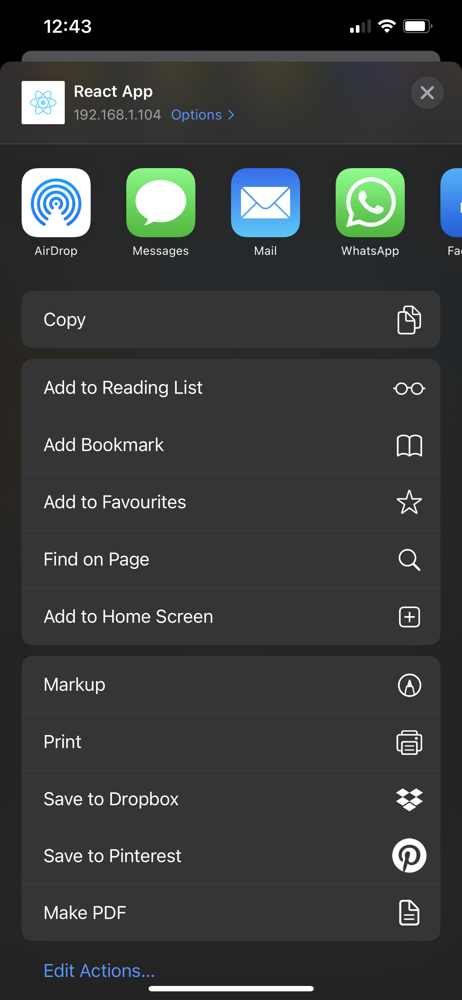
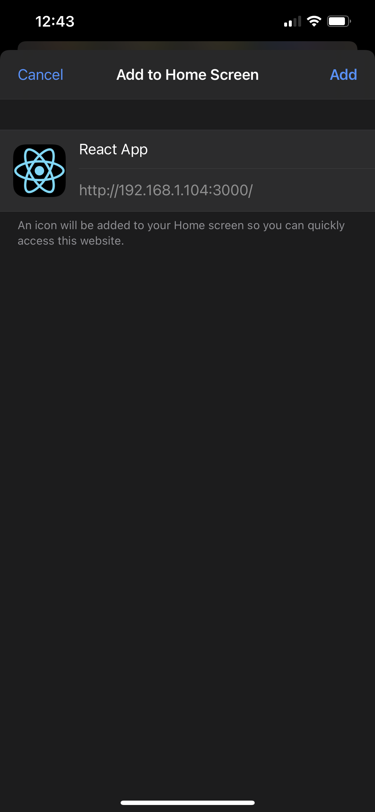
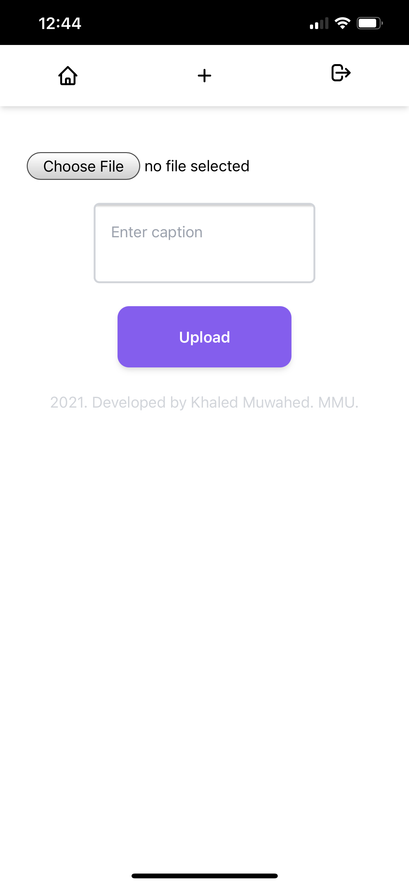
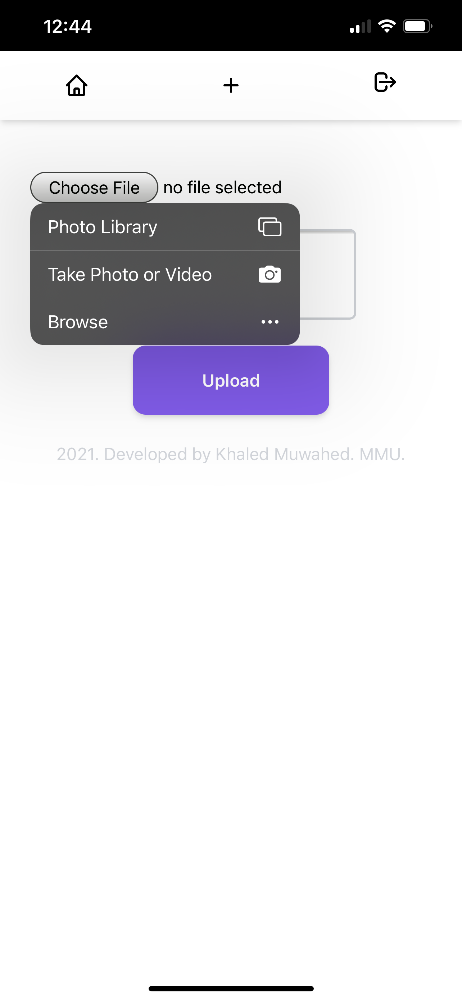
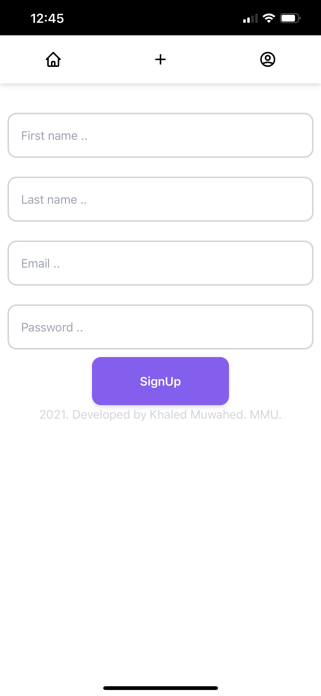

# photo-sharing-app-pwa
A progressive web app that uses Kgram server i previously made as a back-end
Written using React.js

## Demo

Here is a demo of the project.

## Screenshots

Here are some screenshots of the app UI.

    
     
     
